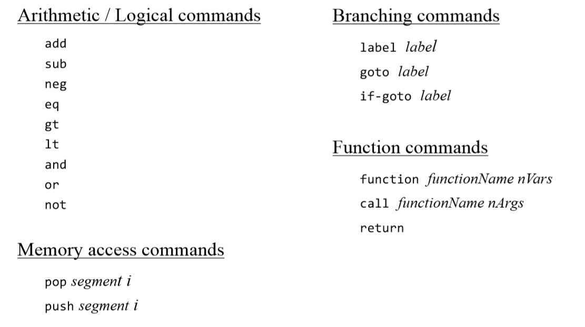
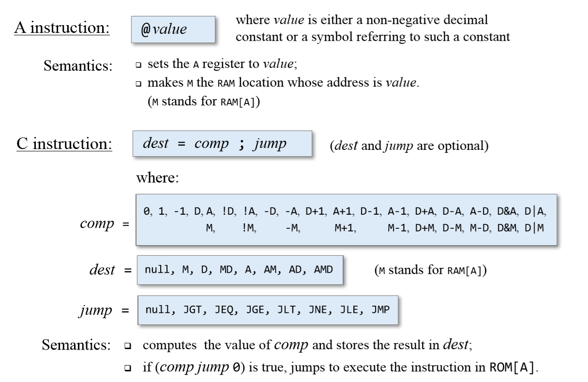
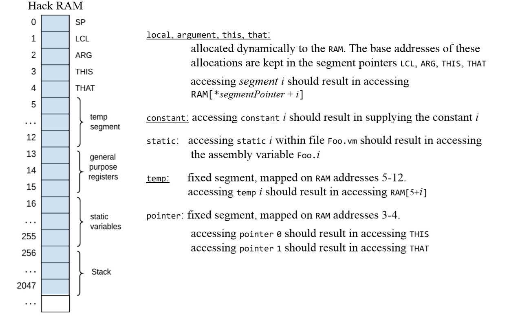
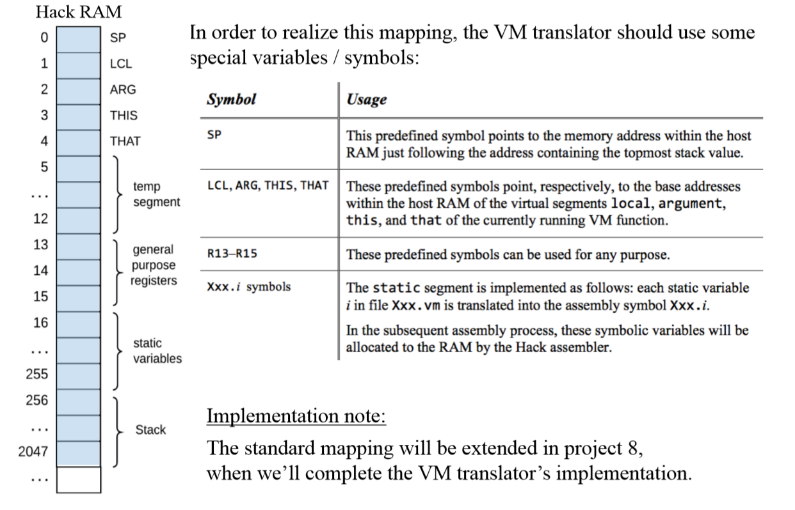

# Jack Virtual Machine Translator

## Source: VM Language

## Target: symbolic Hack Code

## Standard VM mapping on the Hack platform
VM mapping decisions: 
- How to map the VM’s data structures using the host hardware platform 
- How to express the VM’s commands using the host machine language

Standard mapping: 
- Specifies how to do the mapping in an agreed-upon way 
- Benefits: 
  - Compatibility with other software systems 
  - Standard testing

## Be sure to check out [this project](https://github.com/Yuchen-Wang-SH/Build-a-Computer-From-Logic-Gates-to-Operating-System/tree/master/projects/07) of building a whole modern computer from logic gates to operating system!
